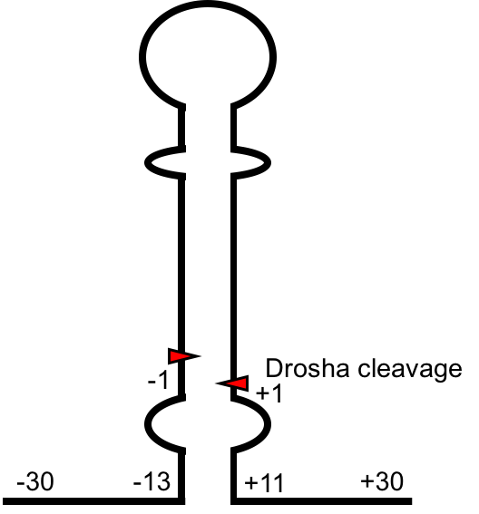

# Lower-stem-secondary-structure
### Scripts used for the analysis of the pri-miRNA lower stem structure.

Genomic sequences of pri-miRNAs were obtained from [UCSC Genome Browser](https://genome.ucsc.edu/). Each pri-miRNA analyzed consists of the pre-miRNA and flanking sequences of 30 nt both sides. The secondary structure was obtained using RNAfold(Gruber et al., 2008), and the bracket-dot notation of the lower stem was analyzed using this R scripts. 

In brief, we first tested whether a nucleotide in one position is paired with another on the other side of the pre-miRNA. Nucleotides that failed such a test were labeled as unpaired. Then, we aligned all pri-miRNA 5p sequences by the 5’ Drosha cleavage site (5’ end of pre-miRNA) and aligned all 3p sequences by the 3’ Drosha cleavage site (3’ end of pre-miRNA). The percentage of paired nucleotides was calculated for each position and was plotted against its relative distance to the Drosha cleavage site.

**References:**
Gruber, A.R., Lorenz, R., Bernhart, S.H., Neuböck, R., and Hofacker, I.L. (2008). The Vienna RNA websuite. Nucleic Acids Res 36, W70-4.
